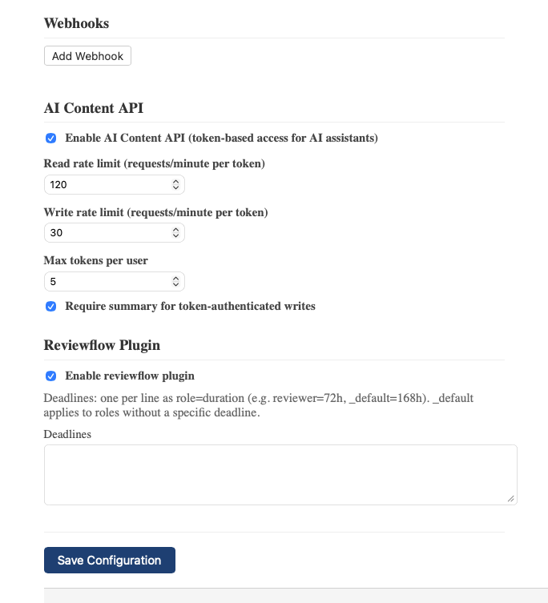

# Configuration

Access: Admin > Configuration

## 1. Site settings

- **Site Title** — displayed in the banner
- **Base URL** — the public URL of the wiki (e.g. `https://wiki.example.com`)
- **Sidebar Page** — page used as the sidebar (default: `sidebar`)
- **Footer Page** — page used as the footer (default: `footer`)
- **TOC Max Level** — maximum heading level shown in the table of contents (0 = disabled)
- **User Display** — how usernames are shown: login, full name, or email
- **Code Theme** — syntax highlighting theme for code blocks

## 1. Authentication

- **Session TTL** — how long sessions last (e.g. `24h`, `168h`)

## 1. OAuth / Microsoft 365

- **Provider** — `azure` or disabled
- **Tenant ID**, **Client ID**, **Client Secret** — Azure AD application credentials
- **Auto-create users** — create user accounts on first OAuth login
- **Default groups** — groups assigned to auto-created users

## 1. Drafts

- **Auto Save Interval** — how often drafts are saved (e.g. `2m`)
- **Stale Lock Timeout** — when locks expire (e.g. `24h`)

## 1. AI Content API

- **Enable** — master switch for token-based API access
- **Read/Write rate limits** — requests per minute per token
- **Max tokens per user** — maximum API tokens a user can create
- **Require summary** — enforce summaries on token-authenticated writes

## 1. Reviewflow

- **Enable** — activate the document validation workflow
- **Deadlines** — per-role timeouts (e.g. `reviewer=72h`)

## 1. Todo

- **Disable** — deactivate the todo plugin (requires restart)
- **Reminder hours** — hours before due date to send reminders

## 1. Email / SMTP

Configure outbound email for todo notifications:
- **From address**, **SMTP host/port**, **username/password**

STARTTLS is negotiated automatically when the server advertises it, so
port 587 is the right choice for the two mainstream providers.

### Google Workspace / Gmail

| Field         | Value                                        |
| ------------- | -------------------------------------------- |
| SMTP host     | `smtp.gmail.com`                             |
| SMTP port     | `587`                                        |
| Username      | the sending mailbox's full address           |
| Password      | an **app password** (not the account password) |
| From address  | the same mailbox, or a verified alias        |

App passwords require 2FA to be enabled on the sending account, then
generated at [myaccount.google.com/apppasswords](https://myaccount.google.com/apppasswords).
The account's regular password is rejected by Gmail's SMTP endpoint.

### Microsoft 365 (Exchange Online)

| Field         | Value                                        |
| ------------- | -------------------------------------------- |
| SMTP host     | `smtp.office365.com`                         |
| SMTP port     | `587`                                        |
| Username      | the sending mailbox's UPN (full address)     |
| Password      | the mailbox's password                       |
| From address  | the same mailbox                             |

Two prerequisites that trip up most first-time setups:

1. **SMTP AUTH must be enabled on the mailbox.** Microsoft disables it
   tenant-wide by default since 2022. An admin turns it on per-mailbox
   from the Admin center → *Users* → the mailbox → *Mail* →
   *Manage email apps* → *Authenticated SMTP*, or in PowerShell:
   `Set-CASMailbox -Identity user@company.com -SmtpClientAuthenticationDisabled $false`.
2. **MFA blocks basic auth.** If the sending account has MFA enabled
   (usually the case), basic SMTP AUTH will fail. The clean paths are
   a dedicated notification mailbox without MFA, or Microsoft's
   modern-auth (OAuth) flow — the latter is not yet wired into this
   admin form.

## 1. Webhooks

Configure outbound webhooks for notifications (Slack, Zulip, etc.):
- **URL**, **HMAC secret**, **enabled/disabled** per webhook
