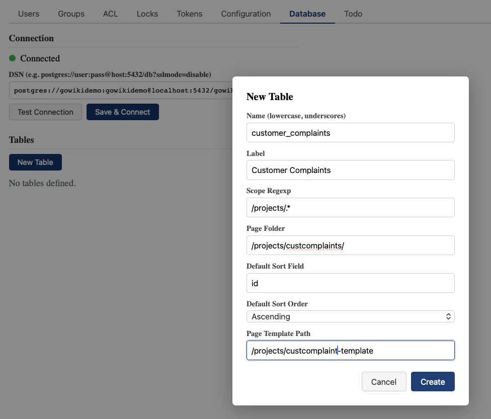
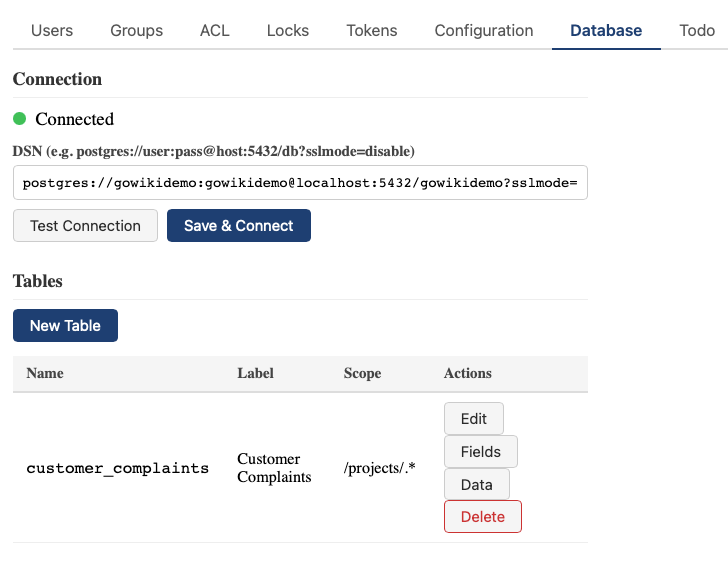
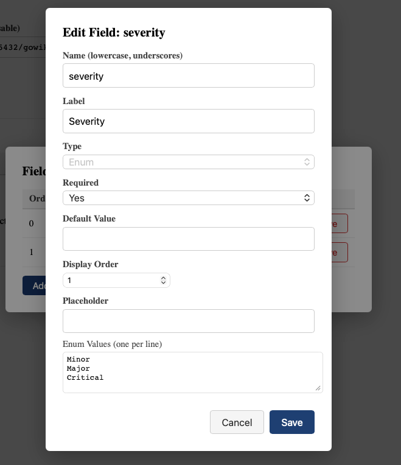
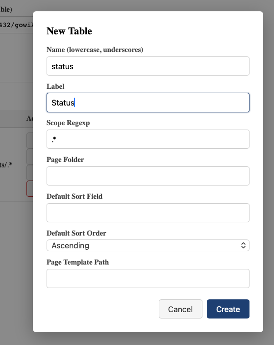
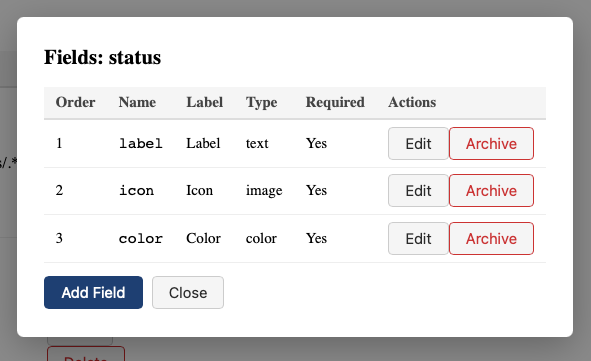
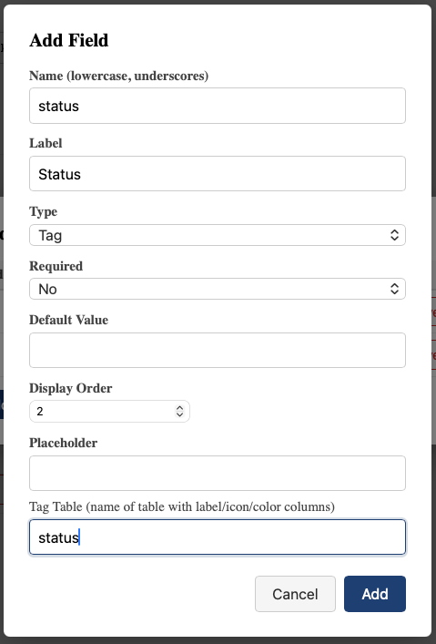

# Database Administration

Access: Admin > Database

## 1. Overview

Gowiki supports structured data tables backed by PostgreSQL. Tables are defined by admins and used by wiki pages to store, query, and display structured information alongside free-form content.

## 1. Connecting

Configure the PostgreSQL DSN in Admin > Configuration > Database, then click **Save & Connect**. The connection status indicator turns green when connected.

## 1. Creating a table

Click **New Table** in Admin > Database. Here we create a `customer_complaints` table to track customer issues:

Each table has:

- **Name** — unique identifier used in directives (e.g. `customer_complaints`). Must be lowercase with underscores.
- **Label** — display name shown in the UI (e.g. "Customer Complaints")
- **Scope regexp** — optional page path pattern restricting where the table's directives are available (e.g. `/projects/.*`)
- **Page folder** — if set, creating a row auto-generates a wiki page at this path (e.g. `/projects/custcomplaints/`)
- **Default sort** — field and direction for default row ordering
- **Page template** — path to a template page for auto-created pages (e.g. `/projects/custcomplaint-template`)

After creation, the table appears in the table list:

## 1. Defining fields

Click **Fields** on a table to manage its columns. Here we define the fields for our complaints table:

Each field has:
- **Name** — column name (used in directives and template variables)
- **Label** — display name
- **Type** — the data type (see below)
- **Required** — whether the field must be filled
- **Default value** — pre-filled value for new rows
- **Enum values** — for enum types, the list of allowed values (one per line)

## 1. Creating a reference table

Tables can reference rows from other tables using the **Tag** field type. To set this up, first create the reference table. Here we create a `status` table:

Then define its fields — `label`, `icon`, and `color`:

## 1. Linking tables with Tag fields

Now we can add a `status` field to `customer_complaints` that references the `status` table. Select **Tag** as the field type and specify the reference table name:

When users fill in a complaint, they select a status from the dropdown populated by the `status` table rows.

## 1. Field types

| Type | Description | SQL type |
| --- | --- | --- |
| Text | Single-line text | `TEXT` |
| Integer | Whole number | `BIGINT` |
| Float | Decimal number | `DOUBLE PRECISION` |
| Boolean | Yes/No | `BOOLEAN` |
| Date | Date without time | `DATE` |
| Datetime | Date with time | `TIMESTAMPTZ` |
| Page Link | Reference to a wiki page | `TEXT` |
| Enum | Single-select from a predefined list | `TEXT` |
| Multi-enum | Multiple-select from a list | junction table |
| Tag | Reference to a row in another table | `BIGINT` FK |
| Lookup | Computed value from a related table | virtual |
| Image | Path to an image file | `TEXT` |
| Color | Color picker | `TEXT` |

## 1. Page-bound tables

Tables can be linked to wiki pages by setting a **Page folder**. When a row is created via `{database-newrow}`, the system:

1. Creates the database row
2. Generates a page path from the folder pattern (e.g. `/projects/custcomplaints/3`)
3. Creates the page from the **Page template** if configured
4. Binds the row to the page via the `page_path` column

The page folder supports tokens:
- `@id` — the row's auto-incremented integer ID
- `@field_name` — value of a named field (e.g. `@name`, `@year`)

## 1. Row identity

Every table has an auto-incrementing `id` column (system-managed, read-only). Rows also have `page_path`, `created_at`, and `updated_at` system columns. The `id` is included in the page's Field/Value table and can be used as a template variable `{{id}}`.

## 1. CSV export

Each table can be exported as CSV via the admin panel (click **Data** on a table) or the API (`GET /api/database/{table}/export/csv`).
