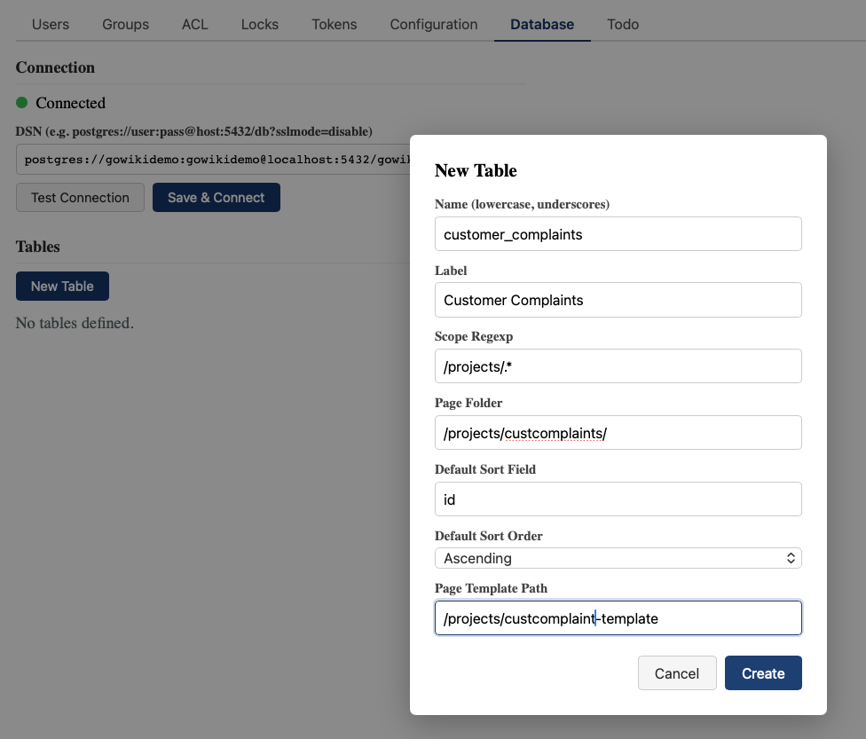
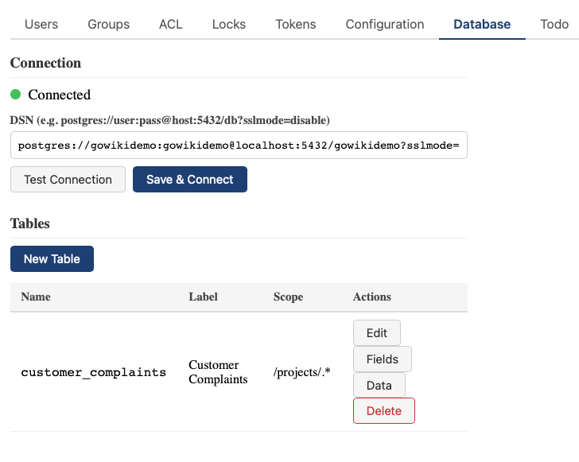
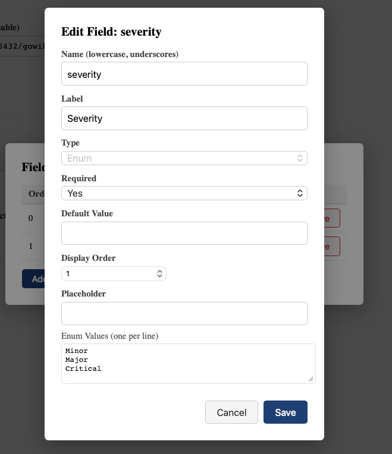
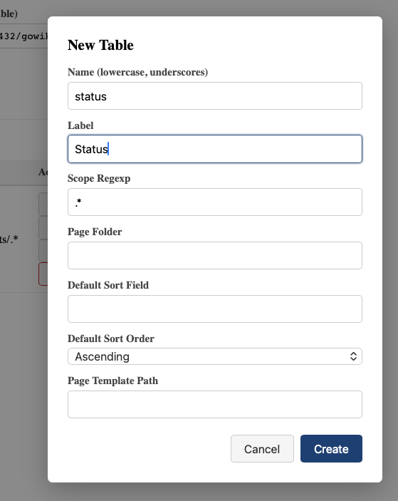
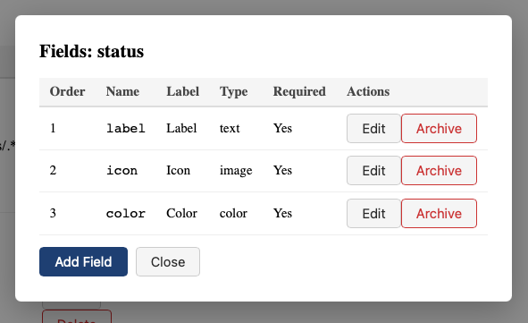
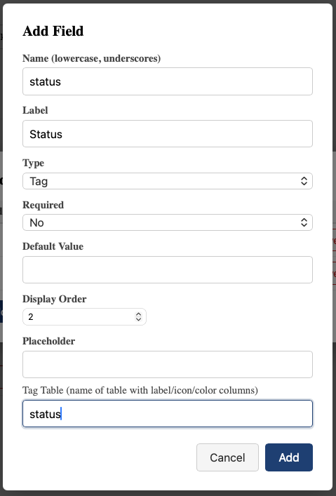

# Database Administration

Access: Admin > Database

## 1. Overview

Gowiki supports structured data tables backed by PostgreSQL. Tables are defined by admins and used by wiki pages to store, query, and display structured information alongside free-form content.

## 1. Connecting

Configure the PostgreSQL DSN in Admin > Configuration > Database, then click **Save & Connect**. The connection status indicator turns green when connected.

## 1. Creating a table

Click **New Table** in Admin > Database. Here we create a `customer_complaints` table to track customer issues:

Each table has:

- **Name** — unique identifier used in directives (e.g. `customer_complaints`). Must be lowercase with underscores.
- **Label** — display name shown in the UI (e.g. "Customer Complaints")
- **Scope regexp** — optional page path pattern restricting where the table's directives are available (e.g. `/projects/.*`)
- **Page folder** — if set, creating a row auto-generates a wiki page at this path (e.g. `/projects/custcomplaints/`)
- **Default sort** — field and direction for default row ordering
- **Page template** — path to a template page for auto-created pages (e.g. `/projects/custcomplaint-template`)

After creation, the table appears in the table list:

## 1. Defining fields

Click **Fields** on a table to manage its columns. Here we define the fields for our complaints table:

Each field has:
- **Name** — column name (used in directives and template variables)
- **Label** — display name
- **Type** — the data type (see below)
- **Required** — whether the field must be filled
- **Default value** — pre-filled value for new rows
- **Enum values** — for enum types, the list of allowed values (one per line)

## 1. Creating a reference table

Tables can reference rows from other tables using the **Tag** field type. To set this up, first create the reference table. Here we create a `status` table:

Then define its fields — `label`, `icon`, and `color`:

## 1. Linking tables with Tag fields

Now we can add a `status` field to `customer_complaints` that references the `status` table. Select **Tag** as the field type and specify the reference table name:

When users fill in a complaint, they select a status from the dropdown populated by the `status` table rows.

## 1. Field types

| Type | Description | SQL type |
| --- | --- | --- |
| Text | Single-line text | `TEXT` |
| Integer | Whole number | `BIGINT` |
| Float | Decimal number | `DOUBLE PRECISION` |
| Boolean | Yes/No | `BOOLEAN` |
| Date | Date without time | `DATE` |
| Datetime | Date with time | `TIMESTAMPTZ` |
| Page Link | Reference to a wiki page | `TEXT` |
| Enum | Single-select from a predefined list | `TEXT` |
| Multi-enum | Multiple-select from a list | junction table |
| Tag | Reference to a row in another table | `BIGINT` FK |
| Lookup | Computed value from a related table | virtual |
| Image | Path to an image file | `TEXT` |
| Color | Color picker | `TEXT` |

## 1. Page-bound tables

Tables can be linked to wiki pages by setting a **Page folder**. When a row is created via `{database-newrow}`, the system:

1. Creates the database row
2. Generates a page path from the folder pattern (e.g. `/projects/custcomplaints/3`)
3. Creates the page from the **Page template** if configured
4. Binds the row to the page via the `page_path` column

### Page folder patterns

**Plain folder** (no `@` anywhere in the value) — the row's integer id is appended automatically:

| Page folder | Row | Page created |
| --- | --- | --- |
| `/projects/custcomplaints` | id=3 | `/projects/custcomplaints/3` |

**Pattern with `@` tokens** — every `@token` is replaced; the surrounding characters are kept verbatim. The id is NOT appended automatically: if you want it, include `@id` yourself.

| Page folder | Row fields | Page created |
| --- | --- | --- |
| `/hr/interviews/@name-@year` | `name="John Doe"`, `year="2024"` | `/hr/interviews/john-doe-2024` |
| `/incidents/@id-@component` | `id=42`, `component="auth"` | `/incidents/42-auth` |

### Token rules

- A token is `@` followed by a lowercase identifier (`a-z`, `0-9`, `_`; must start with a letter). Uppercase or dotted names do not match and stay as literal text — field names in the pattern must match the column name's exact lowercase spelling.
- `@id` is reserved for the row's integer id.
- `@field_name` substitutes the column value, slugified: lowercased, every run of characters outside `a-z 0-9 _ -` collapses to a single `-`, and leading/trailing `-` is trimmed. `"John Doe"` becomes `john-doe`, `"R&D (2024)"` becomes `r-d-2024`.
- Slugification runs per token, not per path segment. Literal characters between adjacent tokens (dashes, underscores, parentheses) survive as-is.
- Several tokens in one segment is fine (`@name-@year` is one segment).

### When a field is empty

If a `@field_name` resolves to an empty, missing, or non-slugifiable value, that one token falls back to the row id. The page URL is always well-formed; an id turning up where you expected a field value is the signal that the field was empty at insert time, not a bug.

### Changing the pattern later

Changing **Page folder** on an existing table does not rename past pages — they keep the URL they were created at. To re-align existing rows with the current pattern, POST to `/api/admin/database/tables/{id}/migrate-page-paths` (defaults to dry-run; pass `{"dry_run": false, "update_links": true}` to execute and rewrite inbound links). There is no admin-UI button for this yet.

## 1. Row identity

Every table has an auto-incrementing `id` column (system-managed, read-only). Rows also have `page_path`, `created_at`, and `updated_at` system columns. The `id` is included in the page's Field/Value table and can be used as a template variable `{{id}}`.

## 1. CSV export

Each table can be exported as CSV via the admin panel (click **Data** on a table) or the API (`GET /api/database/{table}/export/csv`).

## 1. Completing the integration

{blockquote class=important}
> Creating a table in the admin is only the first step. For users to interact with the data, you need to create wiki pages with the appropriate directives:
> 1. **A page with `{database-query}` and `{database-newrow}`** — this is the main data page where users view existing rows and add new ones.
> 2. **(Optional) A page template** — if the table has a **Page folder** configured, create a template page at the **Page template path** you specified. This template controls the layout of auto-generated row-bound pages. Without a template, row-bound pages get a minimal default layout.
> 3. **(Optional) A reference table page** — if you use **Tag** fields that reference another table (like the status table example above), create a page to manage that reference table's rows too.

See the [Database (User Guide)](./database) for step-by-step instructions on creating these pages.
