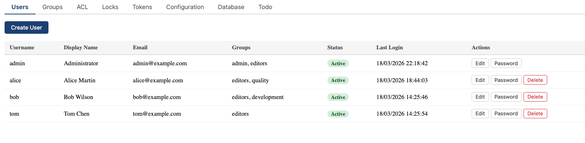

# User Management

Access: Admin > Users

## 1. Creating a user

Click **Create User** and fill in:
- **Username** — login identifier (lowercase, no spaces)
- **Password** — initial password
- **Email** — for notifications and OAuth matching
- **Display name** — shown in the UI
- **Groups** — comma-separated group names

## 1. Editing a user

Click a user to edit their email, display name, groups, or disabled status. Passwords are changed separately via the **Set Password** button.

## 1. Disabling a user

Check the **Disabled** box to prevent a user from logging in. Their sessions and API tokens are immediately invalidated. The user's content and history are preserved.

## 1. Groups

Groups are created in Admin > Groups. Users can belong to multiple groups. Two groups are bootstrapped:
- **admin** — full administrative access
- **editors** — edit permission on all pages (by default ACL)

## 1. OAuth users

Users who log in via OAuth (Microsoft 365) are auto-created if configured. Their OAuth groups are synced on each login and cannot be modified by admins. Local groups can still be assigned.
