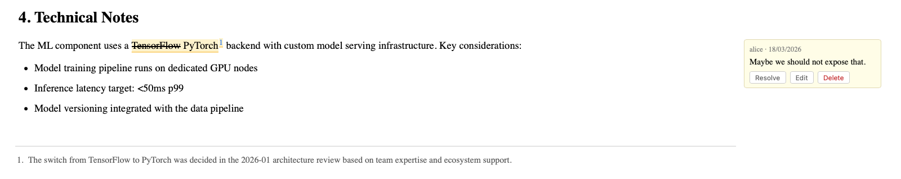

# Comments

Comments allow users to annotate specific parts of a page without modifying the page content.

## 1. Adding a comment

1. **Select text** in the page you want to comment on — the Comment button in the action bar becomes active
2. Click the **Comment** button (or it will show "Comment (select text first)" if no text is selected)
3. A sidebar panel opens with a text field anchored to your selection
4. Type your comment and submit

The selected text is highlighted in yellow to show the anchor.

## 1. Viewing comments

Comments appear in a sidebar panel on the right. Each comment shows:
- The highlighted anchor text
- The comment body
- Author and timestamp

Click a comment in the sidebar to scroll to and highlight its anchor in the page.

## 1. Resolving comments

Comments can be marked as resolved. Resolved comments are hidden by default but can be shown via a toggle.

## 1. When the comment section starts collapsed

If a document has comments but **every top-level thread is resolved**, the comment sidebar starts collapsed — a reader who lands on the page shouldn't have to look past a stack of settled conversations to find the content. The corner chip reflects the state honestly:

- `▶ N` — N open discussions on the page. The sidebar is expanded by default.
- `▶ ✓` — every thread resolved. The sidebar is collapsed by default; click the chip to browse the archive.

Any single unresolved thread on the page keeps the sidebar expanded — that's the actionable signal, and the collapse rule only fires when there's nothing to act on. The behaviour is a first-render default: resolving the last thread mid-session doesn't retroactively collapse the current view.

## 1. Surfacing open comments across many documents

For a QARA-style overview of "which documents still carry unresolved reader feedback," add a `{lifecycle when=comments_open}` rule on an admin page — see [Lifecycle rules](./lifecycle) for the framework. The rule fires on every document in scope with one or more unresolved threads, alert-only (no todo), and the count appears in the lifecycle panel alongside the other rules.

## 1. Storage

Comments are stored as JSON sidecar files in `data/meta/`, separate from the page content. They do not appear in the page's markdown or version history, and they persist across page edits.
