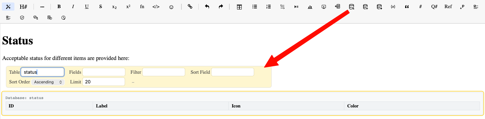
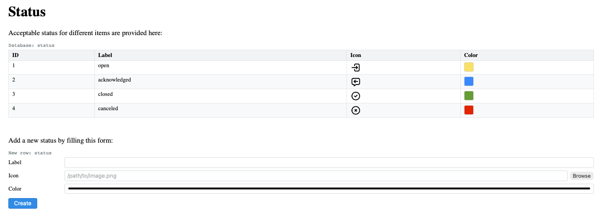
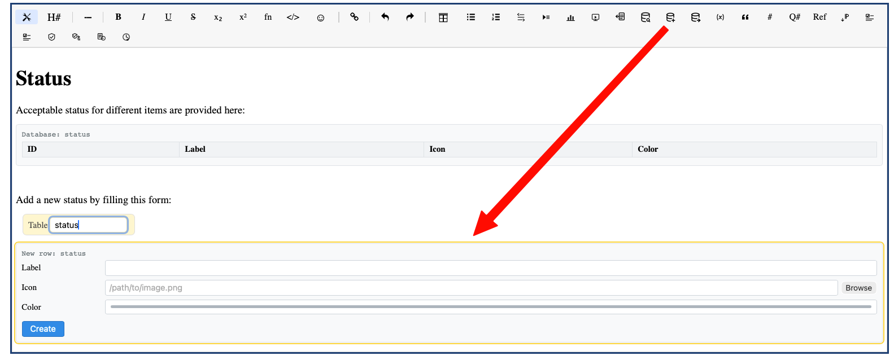
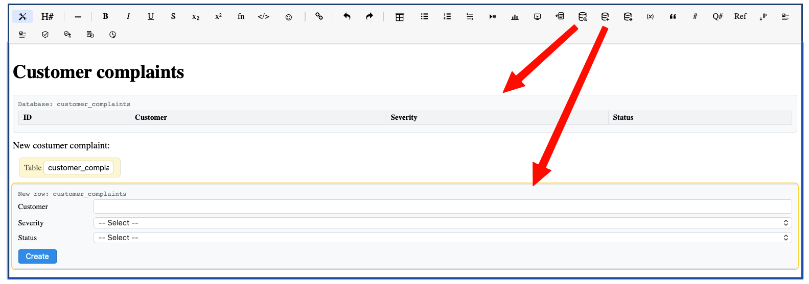
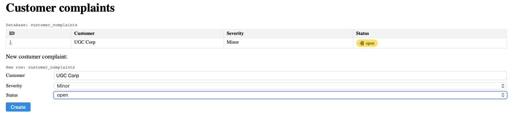
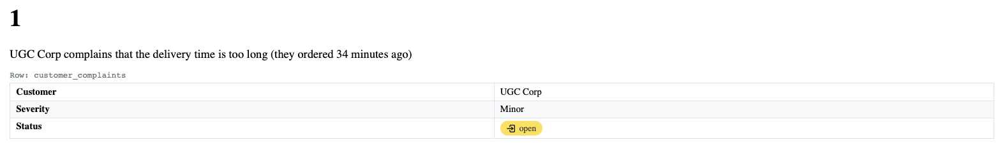
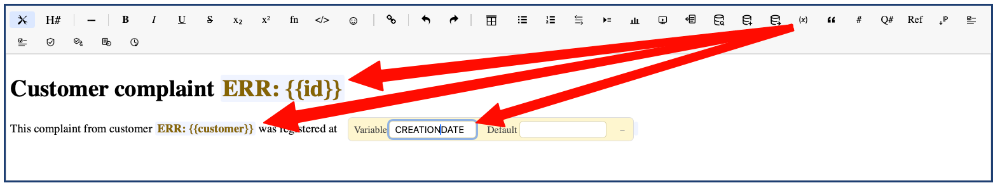
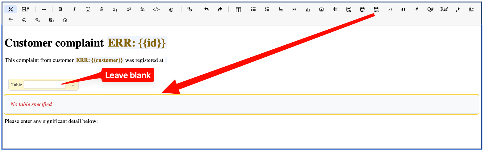
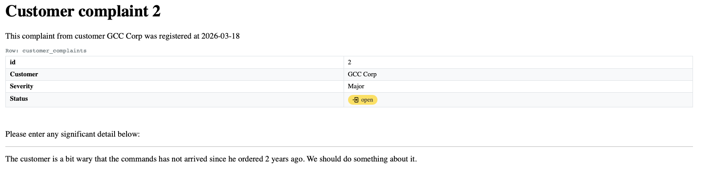

# Database (User Guide)

The database plugin lets you embed structured data in wiki pages — query tables, insert rows, and bind pages to database records.

## 1. Querying data

Display a table of rows using `{database-query}`:

```markdown
{database-query table=status}
```

This renders an interactive table with all rows, sortable and filterable.



The rendered result shows a fully interactive table:



Optional parameters:

```markdown
{database-query table=server fields="category, provider, description" filter="status=active" sort=name order=asc limit=50}
```

| Parameter | Description |
| --- | --- |
| table | Table name (required) |
| fields | Comma-separated list of fields to display (default: all) |
| filter | Filter expression (e.g. `status=active`) |
| sort | Sort field |
| order | `asc` or `desc` |
| limit | Maximum rows to display |

Field names prefixed with `%` are displayed as page links: `fields="%title%, description"` makes the title column a clickable link to the row's bound page.

## 1. Inserting rows

Display an insert form using `{database-newrow}`:

```markdown
{database-newrow table=status}
```

This renders a form with fields matching the table definition:



Here's an example with a query table and a new row form together, for managing customer complaints:



After filling in the form and clicking **Create**, the row appears in the query table above:



For page-bound tables, submitting the form also creates a new wiki page from the table's template.

## 1. Page-bound rows

A page can be linked to a database row using `{database-row}`:

```markdown
{database-row table=customer_complaints}

| Field | Value |
| --- | --- |
| id | 1 |
| customer | UGC Corp |
| severity | Minor |
| status | 1 |
```

The field/value table below the directive syncs the row's data with the database. Here's what a default row-bound page looks like:



Editing the page updates the database row; changing the row via the API or inline edit updates the page.

## 1. Customizing row-bound pages with templates

Instead of the default page layout, you can create a **page template** that uses template variables to display the data in a custom format.

The template uses `{{field_name}}` variables (lowercase) that resolve from the row's fields, and `{{GLOBALVAR}}` variables (uppercase) for page metadata. The template includes a `{database-row}` placeholder (with no table name) that gets replaced with the actual data block:



The `{database-row}` placeholder must be on its own line with a blank line before it. Leave the Table property blank — it will be filled automatically:



When a row is created via the `{database-newrow}` form, the system generates a page from this template with all variables resolved:



## 1. Template variables

Inside a page bound to a database row, lowercase `{{field_name}}` variables resolve to the row's field values:

```markdown
## Customer complaint {{id}}

Customer: {{customer}}
Severity: {{severity}}
```

The `{{id}}` variable resolves to the database row's auto-incremented ID. All field names from the Field/Value table are available.

These are distinct from **global variables** which use ALL_CAPS names (e.g. `{{AUTHOR}}`, `{{CREATIONDATE}}`) and are available on every page regardless of database binding. See [Templates](./templates) for details.

## 1. Toolbar buttons

The editor toolbar provides buttons for inserting database directives:
- **Query** — insert a `{database-query}` block
- **New Row** — insert a `{database-newrow}` form
- **Row** — insert a `{database-row}` binding

When inserting any of these, the property panel opens automatically with focus on the table name field.
