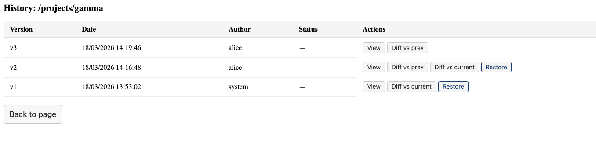
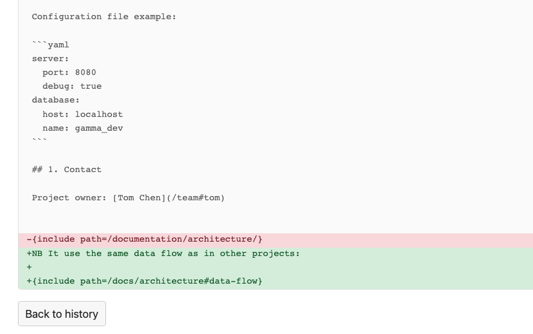

# Page History

## 1. Viewing history

Click **History** in the action bar to see all versions of a page, with timestamps, authors, and summaries.

## 1. Viewing a version

Click **View** on any version to see the page as it was at that point in time. A banner at the top indicates you are viewing an archived version.

## 1. Comparing versions

- **Diff vs prev** — compare a version with its predecessor
- **Diff vs current** — compare a version with the latest published content

Additions are shown in green, deletions in red.

## 1. Restoring

Click **Restore** on a previous version to create a new version with that content. The current content is preserved in history — nothing is lost.

## 1. Reviewflow validation

For pages with reviewflow, the history shows which versions were validated and their version tags (e.g. "2.0"). These badges are clickable and link directly to the validated version.
