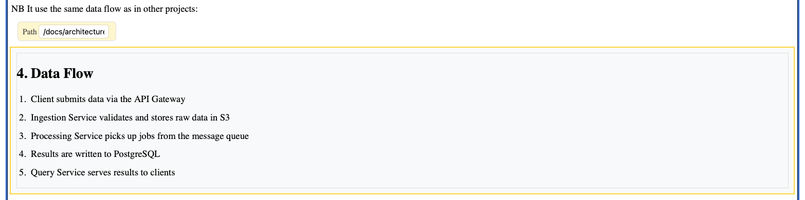

# Includes

Includes let you embed the content of one page inside another.

## 1. Syntax

```
{include path=/wiki/sidebar}
```

The included content renders as a read-only zone in the visual editor, with a yellow property panel showing the source path.



## 1. Section includes

Include a specific section of a page using `#`:

```
{include path=/wiki/sidebar#section-id}
```

## 1. Use cases

- **Sidebar and footer** — the main page includes the sidebar and footer via includes
- **Shared content** — reuse common sections across multiple pages (e.g. disclaimers, headers)
- **Modular documents** — build large documents from smaller sections

## 1. Editing included content

You cannot edit included content inline. Click the source link in the property panel to navigate to the source page and edit it there.

## 1. Circular include detection

The backend detects and rejects circular includes at save time. If saving a page would create a direct or transitive include loop, the save is rejected with an error. The frontend displays the error message.
