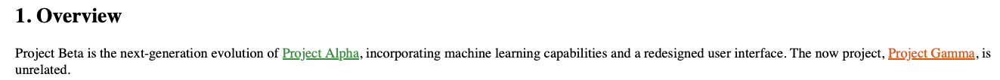

# Links

## 1. Internal page links

```
[Display text](/path/to/page)
```

If the label is empty, the page name is displayed automatically:

```
[](/path/to/page)
```

Relative links are supported:

```
[Sibling page](./other-page)
```



## 1. Section links (anchors)

Link to a section within the current page:

```
[Section title](#section-slug)
```

If the label is empty, the section title and number are displayed automatically:

```
[](#section-slug)
```

This displays as "3.2. Section Title" (with the computed heading number), and updates automatically if sections are reordered.

**Creating section links in the editor:**

1. Press Ctrl+K (or click the link button)
2. Type `#` in the link target field — a list of all sections in the document appears
3. Click a section to insert the link with its title as text
4. **Shift-click** a section to insert an auto-title link (`[](#slug)`) that displays the numbered heading automatically

Section links are colored green if the target heading exists, red if it does not.

## 1. External links

```
[Example](https://example.com)
```

External links display with a distinct icon and open in a new tab.

## 1. Email links

```
[](mailto:user@example.com)
```

Bare email addresses are auto-linked.

## 1. Media / attachment links

Links to files with extensions are treated as attachment downloads:

```
[Download](./report.pdf)
[](./data.csv)
```

The file type icon is displayed automatically.

## 1. Link resolution rules

- `/path/to/page` resolves to `content/path/to/page.md`
- `/path/to/namespace/` resolves to `content/path/to/namespace/index.md`
- `./page` resolves relative to the current page
- `./page.md` is the raw attachment (the `.md` file itself), not the rendered page
