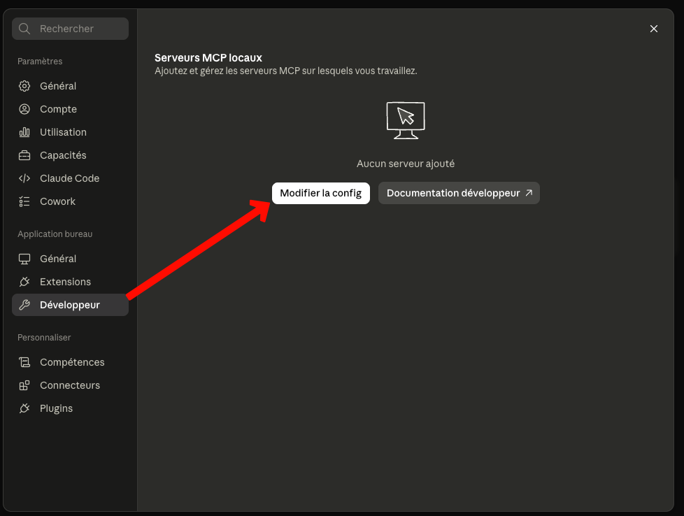
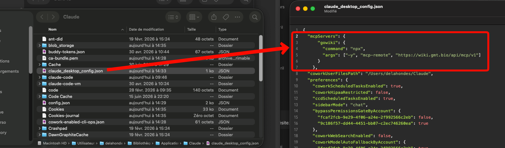

# MCP (Model Context Protocol) Server

Gowiki exposes its AI-oriented API as a full MCP server at `/api/mcp/v1`. An MCP client (Claude Desktop, Claude.ai, Cursor, any MCP-compatible agent) can connect to the wiki as a tool provider, giving the LLM structured access to your pages, todos, structured-data tables, and reviewflow state.

The MCP server is a thin wrapper around the existing AI Content API (`/api/ai/v1/…`). Everything it does is subject to the same ACL model: the authenticated user AND the `@ai` pseudo-subject must both have permission to view (or edit) a page for the operation to succeed.

## Connection

- **URL:** @`https://{{SERVER}}/api/mcp/v1`
- **Transport:** Streamable HTTP (MCP 2025-03-26 spec)
- **Auth:** OAuth 2.0 with browser-based login and consent (no token to copy-paste)

Discovery is handled by the client — the server publishes:

- `/.well-known/oauth-protected-resource` (RFC 9728)
- `/.well-known/oauth-authorization-server` (RFC 8414)
- Dynamic client registration at `/oauth/register` (RFC 7591)

On first use the client is redirected to a wiki login page, then to a consent screen, and finally receives an access token bound to your identity. Revoke it any time under **Admin → Tokens**. Only S256 PKCE is accepted.

### Claude Desktop

Claude Desktop's stable config schema does not yet accept remote HTTP MCP servers directly, so the recommended path is to run Anthropic's `mcp-remote` proxy locally — it speaks stdio to Claude Desktop and forwards to the wiki over HTTP, handling the OAuth dance in your browser on first launch. Requires Node.js on the machine (any recent LTS).

1. Open Claude Desktop → **Settings**. In the sidebar, under **Application bureau**, click **Développeur** (Developer). Click **Modifier la config** (Edit config).

   

2. The `claude_desktop_config.json` file opens in your text editor. Add the `gowiki` entry inside `mcpServers` — for this wiki the URL is @`https://{{SERVER}}/api/mcp/v1`:

   

   ```json
   {
     "mcpServers": {
       "gowiki": {
         "command": "npx",
         "args": ["-y", "mcp-remote", "https://YOUR-WIKI-HOST/api/mcp/v1"]
       }
     }
   }
   ```

3. Save the file and **fully quit** Claude Desktop (Cmd-Q on macOS, right-click → Quit on Windows — closing the window is not enough).

4. Relaunch. On the first tool call, a browser tab opens on the wiki asking you to sign in and approve. Once approved the tab closes and `mcp-remote` caches the token in `~/.mcp-auth/` for future runs.

If nothing happens on the first call, check `~/Library/Logs/Claude/mcp*.log` (macOS) or `%APPDATA%\Claude\logs\` (Windows) for the `mcp-remote` subprocess output.

### Claude.ai (web, paid plans)

On Pro / Team / Enterprise plans, Claude.ai has an **Add custom connector** button in **Settings → Connectors**. Paste the URL — no token, no configuration. The server discovery + OAuth flow described above kicks in the first time.

### Claude Code (CLI)

Claude Code supports remote HTTP MCP servers natively. Two paths:

**With a bearer token (simplest, no browser step):**

1. Create an API token: **Admin → Tokens → New token** on the wiki. Copy the `gwk_...` value shown once.
2. Register the connector — pick a scope:

   ```bash
   claude mcp add gowiki --transport http https://YOUR-WIKI-HOST/api/mcp/v1 \
     --header "Authorization: Bearer gwk_YOUR_TOKEN" -s local
   ```

   For this wiki the URL is @`https://{{SERVER}}/api/mcp/v1`.

   Scope choices (`-s` flag):

   - `local` (default) — this project only, private to you (stored in `.claude/settings.local.json`)
   - `user` — every project on this machine, private to you
   - `project` — this project, shared with teammates (stored in `.mcp.json`, commit to git)

3. Verify with `claude mcp list` or `claude mcp get gowiki`. In a fresh `claude` session the `mcp__gowiki__*` tools appear directly.

**With OAuth (browser consent flow):**

Omit the `--header` flag and Claude Code will fall back to OAuth on first use — it prints an authorization URL you open in a browser, log in on the wiki, click Approve, and Claude Code receives the token via a `http://localhost:PORT/callback` handoff. Same experience as Claude.ai's UI, just driven from the CLI.

**Troubleshooting — connector stuck on auth stubs:**

If `mcp__gowiki__authenticate` shows up instead of the real tool list, Claude Code has cached a failed handshake. In the running session type `/mcp` to open the MCP panel and pick **Reconnect** on `gowiki` — it clears the state and re-does the handshake with the current stored auth. Faster than restarting the whole CLI. Only fall back to `claude mcp remove gowiki && claude mcp add ...` when `/mcp` reconnect doesn't recover.

### mcp-inspector or any raw MCP client

If your client cannot do OAuth (older mcp-inspector, custom scripts, CI), fall back to a personal API token. Create one under **Admin → Tokens** and pass it in the Authorization header. For this wiki the URL is @`https://{{SERVER}}/api/mcp/v1`:

```
npx @modelcontextprotocol/inspector \
  --transport streamable-http \
  --url https://YOUR-WIKI-HOST/api/mcp/v1 \
  --header "Authorization=Bearer gwk_..."
```

## Tools

| Tool | Purpose |
|---|---|
| `get_conventions` | Markdown dialect rules and content guidelines. **Call first.** |
| `list_namespace` | Enumerate pages and sub-namespaces under a path |
| `read_pages_batch` | Read up to 20 pages in one call |
| `get_page_meta` | Page title, version, tags, backlinks, reviewflow status |
| `search_pages` | Full-text, typo-tolerant search — pass `tag` to filter by tag instead (combine with `query` to narrow by substring) |
| `get_reviewflow_status` | Reviewflow roles, confirmations, validation state |
| `preview_page_diff` | Dry-run edit — returns diff without saving |
| `write_page` | Create/update a page — requires a summary |
| `list_todos` | Todo tasks, filterable by status/assignee/namespace/due |
| `complete_todo` | Mark a todo as done |
| `list_database_tables` | Structured-data tables with field definitions |
| `query_database_rows` | Query rows from a structured-data table |

## Searching by tag

`search_pages` accepts an optional `tag` parameter alongside `query`. At least one of the two must be set:

- `query` alone — full-text, typo-tolerant FTS over page bodies. Returns snippets.
- `tag` alone — list every page bearing that tag (no snippets, no ranking).
- `tag` + `query` — pages bearing the tag, narrowed to those whose path or title contains `query` (case-insensitive substring).

All results are filtered by the caller's ACL.

Examples:

```json
{ "tag": "sop" }
{ "tag": "sop", "query": "biomscope" }
```

This is the same syntax the wiki search bar exposes as `tag:NAME [substring]`. See [Tags](/wiki/manual/tags) and [Search](/wiki/manual/search) for the user-facing equivalent.

## Resources

Pages are exposed as `wiki:///path/to/page` URIs via a resource template. Clients can:

- List `wiki:///` as the starting entry point
- Fetch any page path directly through the template

`read_pages_batch` is generally faster for the LLM than issuing multiple `resources/read` calls, so resources are most useful when the client pins a URI as conversation context.

## Prompts

| Prompt | Arguments | Purpose |
|---|---|---|
| `summarize_page` | `path`, `max_bullets` | Bullet summary of a page |
| `draft_review_checklist` | `path` | Reviewer checklist — includes reviewflow state |
| `suggest_tags` | `path` | Propose tags, preferring existing ones |

## Conventions the client must follow

The server advertises these in its instructions and re-exposes them through `get_conventions`. In short:

1. Call `get_conventions` once at session start.
2. Always `preview_page_diff` before `write_page`, and show the diff to the user.
3. Every write requires a summary formatted `[AI: <tool>] <description>`.
4. Optimistic locking: read → preview → write with `expected_version` set to the read version.

## Relationship to the HTTP AI API

The MCP server reuses the same handlers conceptually but is a separate entry point. If you already integrate via `/api/ai/v1/…`, nothing changes — both paths stay available. New agent integrations should prefer MCP because:

- The tool contract is explicit (JSON Schema inputs, typed outputs).
- Resources give clients a native way to include pages as conversation context.
- Prompts centralize ready-made workflows instead of duplicating prompt templates across clients.
