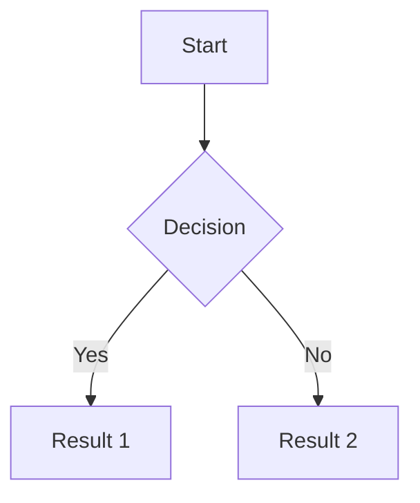
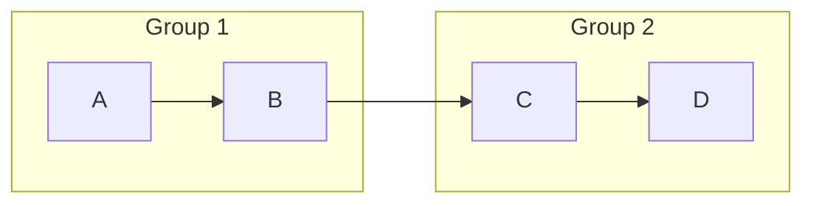
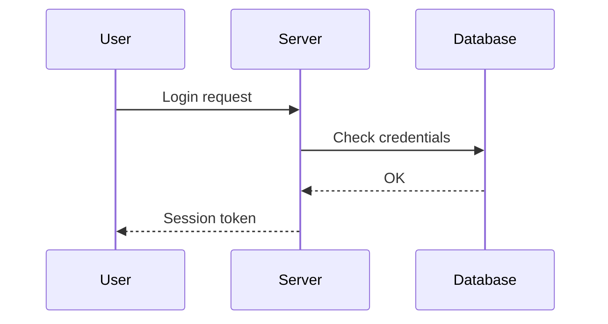

# Mermaid Diagrams

Gowiki supports [Mermaid](https://github.com/mermaid-js/mermaid) diagrams — text-based diagrams rendered as SVG directly in the page.

## 1. Basic syntax

````

````

The diagram source is written inside a ```` ```mermaid ```` fenced block. Mermaid renders it as an interactive SVG.

## 1. Supported diagram types

| Type | Keyword | Description |
| --- | --- | --- |
| Flowchart | `graph TD` or `graph LR` | Boxes and arrows |
| Sequence | `sequenceDiagram` | Message passing between actors |
| Class | `classDiagram` | UML class diagrams |
| State | `stateDiagram-v2` | State machines |
| ER | `erDiagram` | Entity-relationship |
| Gantt | `gantt` | Project timelines |
| Pie | `pie` | Pie charts |
| Git | `gitGraph` | Git branch visualization |
| Mind map | `mindmap` | Hierarchical mind maps |

## 1. Flowchart examples

### Direction

- `graph TD` — top to bottom
- `graph LR` — left to right
- `graph BT` — bottom to top
- `graph RL` — right to left

### Node shapes

```
A[Rectangle]
B(Rounded)
C([Stadium])
D{Diamond}
E[/Parallelogram/]
F((Circle))
G[[Subroutine]]
```

### Arrows

```
A --> B           plain arrow
A -->|label| B    arrow with label
A <--> B          bidirectional
A -.-> B          dotted
A ==> B           thick
```

### Subgraphs

````

````

### Styling

```
style A fill:#f9d2de,stroke:#333,color:#333
style grp1 fill:#99d2f2,stroke:#c7e8ac,color:#333
```

## 1. Sequence diagram example

````

````

## 1. Size property

Add `size=` on the opening line to limit the diagram width:

````

````

The value is a CSS width (e.g. `500px`, `60%`).

## 1. Editing

In the visual editor, click the diagram to select it. The property panel lets you edit:
- **Size** — maximum width of the diagram
- **Diagram source** — the full Mermaid source code

In raw mode, edit the fenced block directly. The source is plain text with real newlines — no escaping needed.

Use the toolbar button (flowchart icon) to insert a new diagram with sample content.

## 1. Multiline labels

Use `\n` inside labels for line breaks:

```
A["Line one\nLine two"]
```

{blockquote class=note}
> The `\n` inside Mermaid labels is Mermaid's own syntax for line breaks within a node label. It is not the same as Gowiki's `\n` hard break syntax.

## 1. References

- [Mermaid documentation](https://mermaid.ai/open-source/)
- [Mermaid live editor](https://mermaid.live/) — try diagrams interactively before pasting into the wiki
- [Mermaid on GitHub](https://github.com/mermaid-js/mermaid)
