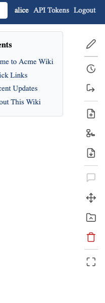

# Quick Start

## 1. Creating a page

1. Navigate to the namespace where you want to create the page
2. Click the **New Page** button in the action bar
3. Enter a page name
4. Start editing — the visual editor opens automatically

## 1. Editing a page

1. Click **Edit** in the action bar to enter edit mode
2. Use the toolbar for formatting (bold, italic, headings, lists, etc.)
3. Toggle between **Visual** and **Raw** mode using the toolbar button
4. Changes are auto-saved as drafts
5. Click **Publish** to save your changes to the wiki

## 1. The action bar

The action bar (right side) provides quick access to:

- **Edit** / **View** — toggle edit mode
- **History** — page version history
- **Backlinks** — pages that link to this one
- **Move** — rename or relocate the page
- **Media** — upload and manage files

## 1. Key shortcuts

| Shortcut | Action |
| --- | --- |
| Ctrl+S (Cmd+S) | Save draft |
| Ctrl+Shift+P | Publish |
| Tab | Indent list item / navigate table cells |
| Shift+Tab | Outdent list item / previous table cell |
