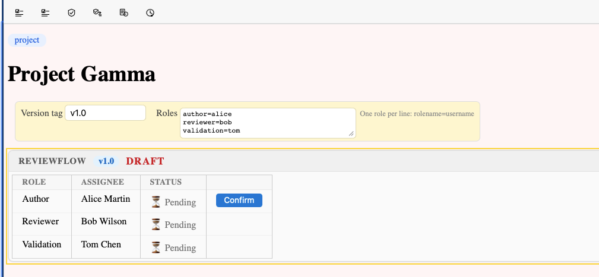
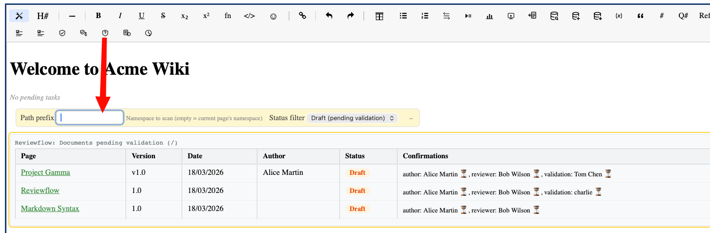

# Reviewflow

Reviewflow is a document validation workflow that tracks version tags and role-based approvals.

## 1. Setting up reviewflow on a page

Add a reviewflow directive to the page:

```
{reviewflow version=1.0 author=alice reviewer=bob validation=charlie}
```

This declares:
- The current version tag (e.g. "1.0")
- The roles and their assigned users

## 1. Approval process

Each role holder sees a confirmation button on the page. Once all roles have confirmed, the version is marked as **validated**.



The reviewflow panel shows:
- Current version tag
- Which roles have confirmed (green checkmarks)
- Which roles are pending

## 1. Version lifecycle

1. Author writes content and sets the version tag (e.g. "1.0")
2. Each reviewer confirms their role
3. When all roles confirm, version "1.0" is validated
4. Author bumps the version tag to "1.1" to start a new cycle
5. Previous confirmations are cleared — the new version needs fresh approvals

## 1. Version history

Validated versions are recorded in the page's reviewflow history. They appear in:
- The **History** tab with "Validated" badges
- **Tag query** tables as clickable version links
- **Change history** tables via `{reviewflow-link version=1.0}` directives

## 1. Reviewflow links

Link to a specific validated version:

```
{reviewflow-link version=1.0}
```

This renders as a clickable badge that navigates to the archived validated version. When used on the current page, it shows just the version number (e.g. "1.0"). When used for another page, it shows the page title and version.

```
{reviewflow-link version=2.0 page=/regulatory/qms/dir/mq01}
```

## 1. Reviewflow query

The `{reviewflow-query}` directive displays a dashboard of all documents pending validation (or all reviewflow documents) under a given path:

```markdown
{reviewflow-query}
```



By default, it scans the current page's namespace and shows only **draft** documents (those with pending confirmations). You can customize:

```markdown
{reviewflow-query path=/regulatory/qms status=all}
```

| Property | Description | Default |
| --- | --- | --- |
| path | Namespace to scan | Current page's namespace |
| status | Filter: `draft`, `validated`, or `all` | `draft` |

The table shows for each document:
- **Page** — clickable link to the page
- **Version** — current version tag (clickable for validated versions)
- **Date** — last modification date
- **Author** — resolved via the user display setting
- **Status** — Draft or Validated badge
- **Confirmations** — per-role status with checkmarks (confirmed) or hourglasses (pending)

Use the toolbar button (shield with question mark) to insert a reviewflow query in visual mode.

## 1. Deadlines

Admins can configure deadlines per role in Admin > Configuration > Reviewflow. When a confirmation is overdue, the todo system can send reminders.
