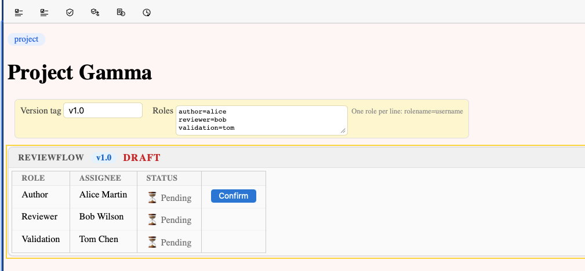
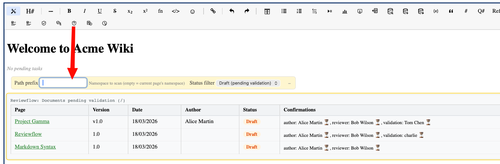

# Reviewflow

Reviewflow is a document validation workflow that tracks version tags and role-based approvals.

## 1. Setting up reviewflow on a page

Add a reviewflow directive to the page:

```
{reviewflow version=1.0 author=alice reviewer=bob validation=charlie}
```

This declares:
- The current version tag (e.g. "1.0")
- The roles and their assigned users

## 1. Approval process

Each role holder sees a confirmation button on the page. Once all roles have confirmed, the version is marked as **validated**.



The reviewflow panel shows:
- Current version tag
- Which roles have confirmed (green checkmarks)
- Which roles are pending

## 1. Notification order

By **default** roles are notified **sequentially**, in the order they appear in the directive. When the page is saved:

1. Only the FIRST role's assignee receives a "please review" todo (and, if email is enabled, an email).
2. When they confirm, the SECOND role's assignee is notified.
3. And so on, until the last role confirms and the version becomes fully validated.

This matches how most regulatory workflows expect an author / reviewer / validator chain to run: the validator is not asked to sign until the reviewer has done their pass. Order comes from the directive's source, not any alphabetical rule — `{reviewflow validator=v reviewer=r author=a}` would put the validator first.

If you need every role to be notified at once instead — for example a peer-review committee where each reviewer scores independently — opt in with `parallel=true`:

```markdown
{reviewflow author=alice reviewer=bob validator=cathy parallel=true}
```

In parallel mode every assignee gets their task the moment the page is saved and can confirm in any order.

## 1. Version lifecycle

1. Author writes content and sets the version tag (e.g. "1.0")
2. Each reviewer confirms their role
3. When all roles confirm, version "1.0" is validated
4. Author bumps the version tag to "1.1" to start a new cycle
5. Previous confirmations are cleared — the new version needs fresh approvals

### Signatures that survive a discard-draft or a restore

Signatures are computed over the page content's digest (SHA-256 of the markdown), not over the page-version integer. When an edit is later discarded and the page returns to the exact bytes a reviewer had signed, that signature is re-attached to the new page version automatically — same digest, same crypto, no re-signing round needed.

The same rule applies to restoring an older version from the history page: if the restored content matches a version a reviewer signed, their signature moves onto the new page version. If the reviewer's role covered a fully-validated set, the page returns to fully-validated in one action.

The re-attach is per-role, per-user. If the review had one signer left before the discard, only the completed signatures are recovered — the missing role still needs its confirmation. Signatures for a role whose assignee has changed since (a different person now holds that seat) do not carry over: the seat is what the current directive names, and the previous holder's endorsement no longer counts as that seat's signature.

Partial signatures (confirmations that never reached a fully-validated set) are now preserved in the page's reviewflow history so an audit can trace who endorsed what content at every step, not only at the fully-validated milestones.

### "Diff since your last signature" link

When a page has a role assigned to you and your previous signature has been invalidated by a subsequent edit, a small `diff since v{N}` link appears next to the **Sign & Confirm** button. It opens a diff between the version you signed and the current version — the same diff view the history page uses — so you can see exactly what moved before re-signing.

The link only appears for a cryptographic signature (X.509), not for click-only confirmations, because the whole point is showing the diff against the specific content you endorsed. First-time reviews (no prior signature) don't show the link.

## 1. Version history

Validated versions are recorded in the page's reviewflow history. They appear in:
- The **History** tab with "Validated" badges
- **Tag query** tables as clickable version links
- **Change history** tables via `{reviewflow-link version=1.0}` directives

## 1. Reviewflow links

Link to a specific validated version:

```
{reviewflow-link version=1.0}
```

This renders as a clickable badge that navigates to the archived validated version. When used on the current page, it shows just the version number (e.g. "1.0"). When used for another page, it shows the page title and version.

```
{reviewflow-link version=2.0 page=/regulatory/qms/dir/mq01}
```

## 1. Reviewflow query

The `{reviewflow-query}` directive displays a dashboard of all documents pending validation (or all reviewflow documents) under a given path:

```markdown
{reviewflow-query}
```



By default, it scans the current page's namespace and shows only **draft** documents (those with pending confirmations). You can customize:

```markdown
{reviewflow-query path=/regulatory/qms status=all}
```

| Property | Description | Default |
| --- | --- | --- |
| path | Namespace to scan | Current page's namespace |
| status | Filter: `draft`, `validated`, or `all` | `draft` |
| user | Restrict to pages where this user has an assigned role. Use `@me` for the currently-logged-in viewer, or a username for a fixed dashboard. | (no filter) |
| when | Narrows the `user` match further: `any` (all assignments), `missing` (user's role hasn't confirmed the current version), `next` (user's role is actionable **right now** — head of the sequential queue, or any missing role in parallel mode), `overdue` (user's role missed its deadline). Ignored when `user` is empty. | `any` |
| signed_by | Restrict to pages where this user has **already confirmed** one of their assigned roles on the current version. Independent of `user` / `when` — combine them to answer "docs waiting on me where Etienne already signed". Use `@me` for the current viewer. | (no filter) |

### Common `user`, `when` and `signed_by` patterns

- **"What must I sign right now?"** — a personal to-do list of the exact
  documents where the reviewflow chain is waiting on the viewer:

  ```markdown
  {reviewflow-query path=/regulatory/qms user=@me when=next}
  ```

- **"What is Etienne on the hook for?"** — a fixed dashboard someone else
  can consult without impersonation:

  ```markdown
  {reviewflow-query path=/regulatory/qms user=etienne.formstecher when=next}
  ```

- **"What's overdue on my desk?"** — same as above but only the pages
  whose deadline has already passed:

  ```markdown
  {reviewflow-query user=@me when=overdue}
  ```

- **"What have I already signed?"** — mirror of `user=@me when=missing`:
  the docs where the viewer holds a role AND has already confirmed it on
  the current version (click-only confirmation or crypto signature,
  either counts):

  ```markdown
  {reviewflow-query user=@me signed_by=@me status=all}
  ```

- **"Docs waiting on me where Etienne already signed."** — the
  "chain-of-approval visibility" case. `user`/`when` filters to the
  docs where you still need to act, `signed_by` further narrows to
  the ones where a specific other role is already confirmed:

  ```markdown
  {reviewflow-query path=/regulatory/qms user=@me when=next signed_by=etienne.formstecher}
  ```

The table shows for each document:
- **Page** — clickable link to the page
- **Version** — current version tag (clickable for validated versions)
- **Date** — last modification date
- **Author** — resolved via the user display setting
- **Status** — Draft or Validated badge
- **Confirmations** — per-role status with checkmarks (confirmed) or hourglasses (pending)

Use the toolbar button (shield with question mark) to insert a reviewflow query in visual mode.

## 1. Observers

Observers are users or groups who can view the reviewflow status of all documents — including draft (unvalidated) pages — without being assigned a role. This is typically used for quality managers who need oversight across the entire QMS.

Configure observers in Admin > Configuration > Reviewflow:

```markdown
alice
group:quality
```

One entry per line. Use `group:name` for groups. Observers:
- See the full reviewflow panel on every reviewflow page (roles, confirmations, deadlines)
- Appear in `{reviewflow-query}` results (the query uses observer access)
- **Cannot** confirm — they are watchers, not approvers
- Are **not** recorded in validation history

{blockquote class=note}
> Observers still need ACL "view" permission on a page to see it. The observer list only controls reviewflow-specific visibility, not page-level access.

## 1. Document signing

Reviewflow confirmations can be cryptographically signed using X.509 certificates. When enabled, users sign the exact content of the document at confirmation time, creating tamper-evident proof of approval.

- [Document Signing — Administration](./signing-admin) — CA setup, certificate management, configuration
- [Document Signing — Users](./signing-user) — How to generate a signing key and sign confirmations
- [Document Signing — Trust Model](./signing-trust) — Security assumptions, audit export, standalone verification

## 1. Deadlines

Admins can configure deadlines per role in Admin > Configuration > Reviewflow. When a confirmation is overdue, the todo system can send reminders.

## 1. Hiding drafts from uninvolved readers

Regulated wikis often need a stronger guarantee: **an unsigned document must not appear as an authoritative reference to people who aren't part of the review chain**. Set the config option `reviewflow.hide_drafts_from_uninvolved: true` (Admin > Configuration > Reviewflow) to turn on this gating. Default is `false` — everything visible — preserving the historical behaviour.

When the gate is on, and a document has a `{reviewflow}` directive whose current version is not fully validated:

- **Uninvolved readers** (not assigned to any role and not a global observer) get the last validated version served transparently. If the document has never been validated, they get 404 — for compliance purposes an unsigned document does not exist for outsiders.
- **Involved readers** (author, reviewer, validator, custom role assignee, group-scoped assignee, or global observer) see the current draft AND a small notice in the reviewflow panel: *"You're viewing a draft. The published version is here."* — with a link to the previous validated version, so they never confuse a WIP with the authoritative procedure.

The gate does not affect documents without a `{reviewflow}` directive, and it never gates the editor path — authors always see what they're editing.
