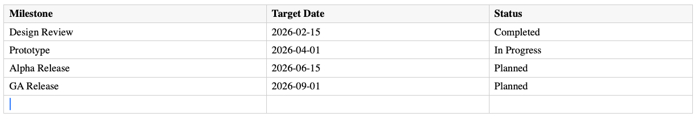
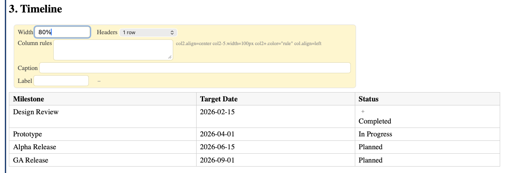

# Tables

## 1. Basic syntax

```markdown
| Header 1 | Header 2 | Header 3 |
| --- | --- | --- |
| Cell 1 | Cell 2 | Cell 3 |
| Cell 4 | Cell 5 | Cell 6 |
```

## 1. Editing tables



In visual mode:
- **Tab** moves to the next cell
- **Shift+Tab** moves to the previous cell
- Use the toolbar or right-click menu to add/remove rows and columns

In raw mode, edit the pipe-delimited text directly.

## 1. Table properties

Select a table to open its property panel. Available properties:



| Property | Description | Example |
| --- | --- | --- |
| Width | Table width (CSS value or percentage) | `80%`, `600px` |
| Headers | Which rows/columns are headers | `1 row`, `2 rows`, `1 row, 1 column` |
| Column rules | Per-column formatting rules (see below) | `col2.align=center` |
| Caption | Table caption displayed below the table | `Table 1: Results` |
| Label | Label for cross-references | `results` |

## 1. Column rules

Column rules let you control alignment, width, and coloring for entire columns. Enter rules in the **Column rules** field of the table property panel:

```
col2.align=center
col2-5.width=100px
col.align=left
```

**Syntax:** `col<spec>.<property>=<value>`

Column selectors:
- `col` — all columns
- `col2` — column 2 only
- `col2-5` — columns 2 through 5
- `col2+` — column 2 and all following

Properties:
- `align` — horizontal text alignment: `left`, `center`, `right`
- `valign` — vertical alignment: `top`, `centered`, `bottom` (a cell-level `valign` overrides the column value)
- `width` — column width: `100px`, `20%`
- `color` — conditional background coloring rules (see below)
- `decimals` — display numeric cells with a fixed number of decimal places (see below)

## 1. Numeric formatting

The `decimals` rule controls how many digits appear after the decimal point for cells whose content parses as a number. The source markdown is unchanged — only the rendered view is reformatted, so round-trip stays lossless.

```
col3.decimals=2
```

With `decimals=2`, cell content `3` renders as `3.00`, `3.14159` renders as `3.14`, and `1234` renders as `1234.00`. Non-numeric cells (labels, blanks, headers, anything wrapped in backticks) are left alone.

The formatting is applied live in both view and visual edit mode. When the selection (caret) enters a formatted cell, that single cell reverts to its raw value so you can read and edit the actual digits — spreadsheet-style. Move the selection elsewhere and the formatted view returns.

## 1. Conditional coloring

Column color rules apply background colors to cells based on their content. Set a color rule on a column using:

```
col3.color=">=80 #c8e6c9, >=50 #fff9c4, <50 #ffcdd2"
```

This colors cells in column 3: green if >= 80, yellow if >= 50, red if < 50.

**Rule syntax:** Each rule is `<condition> <color>`, separated by commas.

Conditions:
- `=value` — exact match (text or number)
- `>N`, `>=N`, `<N`, `<=N` — numeric comparison
- `!=value` — not equal
- `~pattern` — regex match
- `empty` — cell is empty
- `!empty` — cell is not empty
- `else` — catch-all fallback

Colors can be any CSS color: hex (`#c8e6c9`), named (`green`), or RGB.

Example — color a status column:

```
col4.color="=Completed #c8e6c9, =In Progress #fff9c4, =Planned #e3f2fd, else #f5f5f5"
```

## 1. Cell-level formatting

Individual cells can have their own colors and text direction, set via cell directives in raw mode:

```markdown
| {color=#e8f5e9} Green cell | {text-color=red} Red text | Normal |
```

Available cell directives:
- `{color=<css-color>}` — background color
- `{text-color=<css-color>}` — text color
- `{vtext=upward}` or `{vtext=downward}` — vertical text direction

## 1. Cell spanning

Merge cells horizontally or vertically using special markers in raw mode:

- `<<` — merge this cell with the one to its left (colspan)
- `^^` — merge this cell with the one above (rowspan)

```markdown
| Wide header | << | << |
| --- | --- | --- |
| A | B | C |
```

This creates a header that spans all three columns.

## 1. Formulas

Table cells support spreadsheet-like formulas. Start a cell with `=` to make it a formula:

```markdown
| Item | Price | Qty | Total |
| --- | --- | --- | --- |
| Widget | 10 | 5 | =B2*C2 |
| Gadget | 25 | 3 | =B3*C3 |
| | | **Sum** | =SUM(D2:D3) |
```

**Cell references** use spreadsheet notation: `A1` is column A, row 1. The header row is row 1.

**Available functions:**

- `=SUM(range)` — Sum of values in a range. Example: `=SUM(B2:B5)`
- `=AVG(range)` — Average of values. Example: `=AVG(B2:B5)`
- `=MIN(range)` — Minimum value. Example: `=MIN(B2:B5)`
- `=MAX(range)` — Maximum value. Example: `=MAX(B2:B5)`
- `=COUNT(range)` — Count of non-empty cells. Example: `=COUNT(B2:B5)`
- `=IF(cond, then, else)` — Conditional value. Example: `=IF(B2>100, "high", "low")`
- `=ROUND(value, digits)` — Round to N decimal places. Example: `=ROUND(AVG(B2:B5), 2)`
- `=SUM(ABOVE)` — All data cells above in the same column (excludes header rows)
- `=SUM(LEFT)` — All data cells to the left in the same row (excludes header columns)

**Operators:** `+`, `-`, `*`, `/`, `>`, `<`, `>=`, `<=`, `=`, `!=`

**Example — Acme Corp fruit sales:**

Here is the raw markdown source:

```markdown
{table headers=1r1c}
| Product | 2024 | 2025 | 2026 | Row Total | Row Avg |
| --- | --- | --- | --- | --- | --- |
| Apples | 1200 | 1450 | 1800 | =SUM(LEFT) | =ROUND(AVG(B2:D2), 0) |
| Bananas | 800 | 950 | 1100 | =SUM(LEFT) | =ROUND(AVG(B3:D3), 0) |
| Oranges | 600 | 720 | 890 | =SUM(LEFT) | =ROUND(AVG(B4:D4), 0) |
| **Total** | =SUM(ABOVE) | =SUM(ABOVE) | =SUM(ABOVE) | =SUM(ABOVE) |  |
| **Average** | =ROUND(AVG(ABOVE), 0) | =ROUND(AVG(D2:D4), 0) | =ROUND(AVG(F2:F4), 0) |  |  |
| **Best** | =MAX(B2:B4) | =MAX(C2:C4) | =MAX(D2:D4) |  |  |
```

Note the `{table headers=1r1c}` directive — it tells the wiki that the first row AND first column are headers. This matters for `ABOVE` and `LEFT` which exclude header cells.

And here is the rendered result with formulas computed:

{table headers=1r1c}
| Product | 2024 | 2025 | 2026 | Row Total | Row Avg |
| --- | --- | --- | --- | --- | --- |
| Apples | 1200 | 1450 | 1800 | =SUM(LEFT) | =ROUND(AVG(B2:D2), 0) |
| Bananas | 800 | 950 | 1100 | =SUM(LEFT) | =ROUND(AVG(B3:D3), 0) |
| Oranges | 600 | 720 | 890 | =SUM(LEFT) | =ROUND(AVG(B4:D4), 0) |
| **Total** | =SUM(ABOVE) | =SUM(ABOVE) | =SUM(ABOVE) | =SUM(ABOVE) |  |
| **Average** | =ROUND(AVG(ABOVE), 0) | =ROUND(AVG(D2:D4), 0) | =ROUND(AVG(F2:F4), 0) |  |  |
| **Best** | =MAX(B2:B4) | =MAX(C2:C4) | =MAX(D2:D4) |  |  |

`ABOVE` and `LEFT` are especially useful for totals rows and columns — they automatically adjust when rows or columns are added, and they exclude header rows/columns from the computation.

**Operators:** `+`, `-`, `*`, `/`, `>`, `<`, `>=`, `<=`, `=`, `!=`

Formulas update live as you edit the table. In view mode, only the computed result is displayed. In edit mode, a formula indicator appears on computed cells.

## 1. Limitations

- Column alignment syntax from CommonMark (`|:---|`, `|:---:|`, `|---:|`) is not supported — use column rules instead
- Multi-body tables (multiple `<tbody>` sections) are not supported
