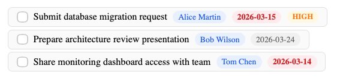
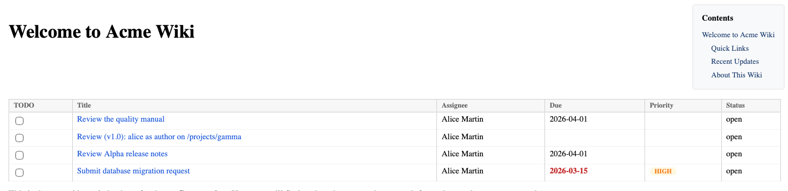

# Todo Tasks

The todo plugin lets you assign and track tasks within wiki pages.

## 1. Requirements

Todo requires a PostgreSQL database connection (configured in Admin > Configuration > Database).

## 1. Syntax

A todo is a self-contained directive on its own line:

```markdown
{todo title="Review the quality manual" assign="alice" due=2026-04-01}
```

All properties are specified within the curly braces. The description, if needed, is also a property:

```markdown
{todo title="Translate section 3" assign="bob" description="Translate from French to English, preserve formatting"}
```



## 1. Properties

| Property | Description | Example |
| --- | --- | --- |
| title | Task title (required) | `title="Review document"` |
| assign | Assignee (user or group:groupname) | `assign="alice"` or `assign="group:editors"` |
| due | Due date (`YYYY-MM-DD`) | `due=2026-04-01` |
| recur | Recurrence: bare `N` or `Nd` = N days (delay since completion); `Nw` / `Nm` / `Ny` or `Nweeks` / `Nmonths` / `Nyears` = calendar interval; `daily` / `weekly` / `monthly` / `yearly` for the common cases | `recur=30`, `recur=6m`, `recur=1y`, `recur=weekly` |
| mode | For calendar recurrences only: `at-least` (default) or `fixed`. See "Recurrence modes" below. | `mode=fixed` |
| tolerance | For calendar recurrences only: how close to the due date an early completion still counts as on-time. `N%` of the period or `Nd` absolute days. Default: `10%` (floor 1 day). | `tolerance=20%`, `tolerance=30d`, `tolerance=0d` (strict) |
| priority | Priority level | `priority=high` |
| action | Trigger that auto-completes the task — one of `read:/path`, `edit:/path`, `create:/pattern`, `set_meta:/path:schema:field:value`. See the "Action triggers" section below for the four shapes. | `action="read:/qms/sop01"`, `action="create:/qms/campaigns/.*"` |
| description | Longer description | `description="Details here"` |
| tags | Comma-separated tags | `tags="urgent,quality"` |

## 1. Recurrence modes

Calendar recurrences (`recur=1y`, `recur=weekly`, etc.) ship with two modes that handle early completion differently. The default is `at-least`.

**`at-least`** — "no more than N units between completions". Suits regulatory cycles ("SOP review at least every 3 years"). The default — picked because it matches the dominant QMS use case and prevents silent compliance drift.

- Done on time or late: next due = `currentDue + N units` (standard cadence).
- Done early, within tolerance of the due date: next due = `currentDue + N units` (prevents schedule drift when the user consistently finishes a day or two early).
- Done early, beyond tolerance: next due = `completedAt + N units` (re-anchors to the completion so the gap stays within N).

**`fixed`** — the calendar schedule is sacred (think: tax filing, scheduled audits). An early completion beyond tolerance is recorded but does **not** satisfy the current cycle; the next instance keeps the original due date so the user still gets the alert on the scheduled day.

- Done on time, late, or within tolerance of the due date: next due = `currentDue + N units`.
- Done early, beyond tolerance: next due = `currentDue` unchanged — the schedule stays put.

### Tolerance

`tolerance` controls what counts as "early" vs "on-time". Default is 10% of the period, floored at 1 day — so a yearly task tolerates ~36 days of early completion, a monthly task tolerates 3 days, and a weekly or daily task tolerates 1 day.

Override per task with `tolerance=20%`, `tolerance=30d`, or `tolerance=0d` for strict mode. A tolerance larger than the period is clamped to the period.

### Worked example

```
{todo title="Annual SOP review" assign=alice due=2027-01-01 recur=1y}
```

Default (`at-least`, `tolerance=10%`):

| Completed on | Next due | Reason |
|---|---|---|
| 2027-01-01 | 2028-01-01 | on time |
| 2027-03-01 | 2028-01-01 | 2 months late — cadence preserved |
| 2026-12-10 | 2028-01-01 | 22 days early, within 36-day tolerance — no drift |
| 2026-06-01 | 2027-06-01 | 7 months early, outside tolerance — re-anchors |

Same task with `mode=fixed`:

| Completed on | Next due | Reason |
|---|---|---|
| 2027-01-01 | 2028-01-01 | on time |
| 2027-03-01 | 2028-01-01 | late — cadence preserved |
| 2026-12-10 | 2028-01-01 | within tolerance — cycle satisfied |
| 2026-06-01 | 2027-01-01 | outside tolerance — cycle **not** satisfied, task re-appears at original due |

## 1. Group assignments

- `assign="alice"` — assigns to user alice
- `assign="group:editors"` — assigns to the editors group
- `assign="alice,group:editors"` — assigns to both

When assigned to a group, the `resolution` property controls completion:
- `resolution=any` (default) — any group member can complete the task
- `resolution=all` — all group members must acknowledge

## 1. Action triggers

The `action=` attribute turns a todo into a self-completing task tied to a specific wiki event. When the assignee performs the matching action, the task flips to `done` without any manual click. Four shapes, each with its own event:

| Shape | Fires when the assignee … | Example |
| --- | --- | --- |
| `read:/path` | Opens `/path` in view mode | `action="read:/qms/sop01"` |
| `edit:/path` | Publishes an edit to `/path` (any change counts) | `action="edit:/qms/sop01"` |
| `create:/regex` | Creates a page whose canonical path matches the regex | `action="create:/qms/campaigns/.*"` |
| `set_meta:/path:schema:field:value` | Sets a specific metadata field to a specific value on `/path` | `action="set_meta:/qms/sop01:qms:status:validated"` |

### 1. `create:` — regex pattern on the new page's path

`create:/pattern` is matched against the newly-created page's canonical path (leading slash, no `.md` extension) with the regex wrapped as `^<pattern>$`. The pattern is Go's RE2 flavour.

Common patterns:

| Pattern | Matches |
| --- | --- |
| `create:/qms/campaigns/.*` | Any page at `/qms/campaigns/...`, at any depth (`.*` matches `/`) |
| `create:/qms/campaigns/[^/]+` | **Direct** children of `/qms/campaigns/` only — the character class refuses `/` |
| `create:/qms/sop07(/.*)?` | The page `/qms/sop07` **or** anything under it (`?` makes the suffix optional) |
| `create:/qms/sop\d+` | A page like `/qms/sop01`, `/qms/sop42`, … |

Because the wrap is `^...$`, a bare `create:/qms/sop07` with no suffix matches **only** that exact path — not sub-pages under it. The anchoring is strict on both ends.

### 1. Assignee gate

The auto-complete only fires when the user performing the save is the task's **assignee** (or a member of the assigned group when `resolution=any`). If someone else creates a matching page, the task stays open — the todo is a "who did X" record, not a "did X get done" record.

### 1. Writes that fire the trigger

Every path that writes a page fires the trigger — direct HTTP saves, MCP `write_page` / `edit_page` / `publish_edit_draft` / `create_page_from_template`, database row inserts and updates that touch a bound page. The storage layer owns the hook, so adding a new write surface in the future picks it up automatically.

## 1. Task lifecycle

1. Task is created when the page is saved
2. Assignees see the task in their task panel and receive notifications
3. Assignees acknowledge the task (e.g. by reading the page for `action=read:...` or creating a matching page for `action=create:...`)
4. Completed tasks can recur if `recur` is set

## 1. Todo list



Display a list of tasks using the `{todo-list}` directive:

```markdown
{todo-list}
```

Optional filters:

```markdown
{todo-list assign="alice" status="open,in_progress" priority="high,urgent"}
```

If no assignee is specified, the list shows tasks for the current user.

## 1. Notifications

When configured, assignees receive notifications via:
- **Email** — SMTP settings in Admin > Configuration
- **Webhooks** — for Slack, Zulip, or other integrations
- **Real-time** — in-browser notifications via SSE
