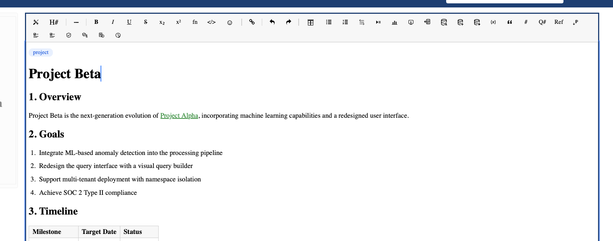
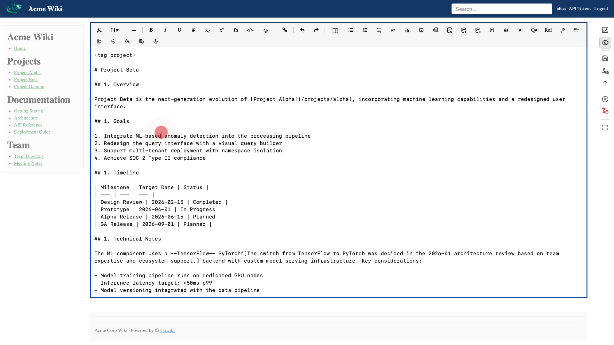
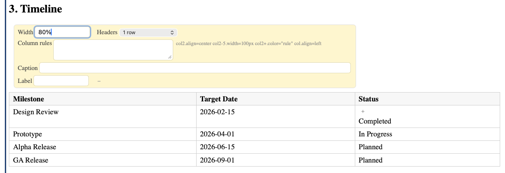

# Visual Editor

The visual editor provides a WYSIWYG editing experience powered by ProseMirror. It is the default editing mode.

## 1. Toolbar

The toolbar provides buttons for common formatting:
- **B** / **I** / **U** / **S** — bold, italic, underline, strikethrough
- **H1–H6** — heading levels
- **Lists** — unordered and ordered lists
- **Table** — insert a table
- **Link** — insert or edit a link
- **Image** — insert an image via the media manager
- **Code** — insert a code block
- **Include** — insert an include directive
- **Footnote** — insert an inline footnote

## 1. Switching modes

Click the **Raw** / **Visual** toggle in the toolbar to switch between visual and raw markdown editing. Both modes edit the same content — switching is lossless. A red beacon pulses at the cursor position to help you find your place after switching.

## 1. Tables in visual mode

- Click inside a cell to edit it
- Use **Tab** to move to the next cell, **Shift+Tab** for the previous cell
- Right-click or use the table toolbar to add/remove rows and columns
- Tables support a property panel for advanced settings (size, cell formatting)

## 1. Images in visual mode

- Drag and drop an image onto the editor to upload and insert it
- Click an image to select it and reveal resize handles
- Hold **Shift** while dragging a handle to constrain proportions
- The size property updates live in the markdown source

## 1. Property panels

Some elements (images, tables, includes, code blocks) have a property panel that appears when the element is selected. Click the **+** button to expand all available properties.

Properties panels stay open while you edit values — they only close when you move focus away from the element.

## 1. Read-only zones

Included content (from `{include}` directives) and the sidebar/footer are displayed as read-only zones. You cannot edit them inline — navigate to the source page to modify them.

## 1. Editing around block atoms

Some elements are **block atoms** — a single indivisible chunk of content that takes a whole line: todos, images, includes, mermaid diagrams, database blocks. When two block atoms sit right next to each other (e.g. a list of todos), the caret needs somewhere to sit *between* them; two behaviours make that painless:

- **Arrow keys open a gap cursor between adjacent atoms.** Press → on a selected todo and the caret lands in the gap before the next todo, drawn as a thin blinking line spanning the space. Typing at a gap cursor starts a new paragraph between the two atoms.
- **Typing while an atom is selected inserts a new paragraph after it** instead of replacing the atom with the typed character. Click on a todo, then type "note about this task": the todo stays, a new paragraph carrying "note about this task" appears right below it. The atom is never lost to an accidental keystroke.
